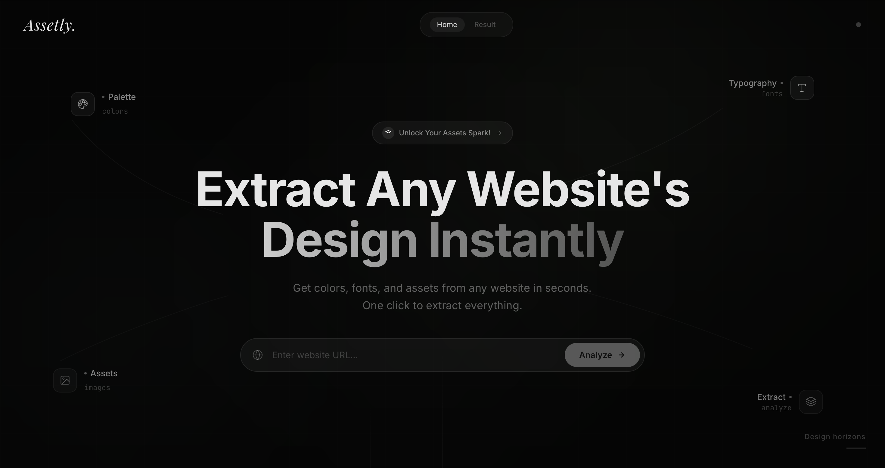

# Assetly

Assetly extracts a website's visual identity in seconds: color system, typography, and image assets.



## What it does

- Accepts any website URL
- Visits the page with headless Chromium (Playwright)
- Extracts raw style and media data from the DOM
- Processes that data into structured design tokens:
	- `colors`: primary, secondary, accent, background, text, full palette
	- `fonts`: primary, secondary, and full font list
	- `assets`: logos, icons, and images

## Tech stack

- Next.js `16.2.1` (App Router)
- React `19`
- TypeScript
- Tailwind CSS `v4`
- Playwright (server-side website analysis)
- ESLint + Next.js config

## Project structure

```text
app/
	api/analyze/route.ts        # API endpoint that runs extraction
	page.tsx                    # Main client UI and state flow
	globals.css                 # Global styles and animations
components/
	UrlInput.tsx                # URL input and submit interaction
	Results.tsx                 # Results orchestration
	ColorPalette.tsx            # Color cards + copy-to-clipboard
	FontList.tsx                # Typography preview cards
	ImageGrid.tsx               # Asset grids (logos/icons/images)
	LoadingState.tsx            # Skeleton/loading experience
lib/
	types.ts                    # Shared result contracts
	analyzer/
		colorAnalyzer.ts          # Color parsing, clustering, role selection
		fontAnalyzer.ts           # Font normalization and ranking
		imageAnalyzer.ts          # URL validation + asset classification
		utils.ts                  # Color math and shared helpers
public/
	assetly.png                 # Assetly brand asset/logo
```

## How it works

1. User submits a URL from the UI.
2. Client posts to `POST /api/analyze`.
3. API normalizes/validates URL and opens the page with Playwright.
4. Browser context collects:
	 - computed colors
	 - computed `font-family` values
	 - image URLs from CSS/backgrounds, ``, and `<source srcset>`
5. Analyzer modules convert raw values into a cleaned `AnalysisResult`.
6. Frontend renders design cards for colors, fonts, and assets.

## Local development

### Prerequisites

- Node.js `18.18+` (recommended: latest LTS)
- npm (or pnpm/yarn/bun)

### Install

```bash
npm install
```

### Run dev server

```bash
npm run dev
```

Open `http://localhost:3000`.

### Build and start

```bash
npm run build
npm run start
```

### Lint

```bash
npm run lint
```

## API

### `POST /api/analyze`

Request body:

```json
{ "url": "https://example.com" }
```

Successful response shape:

```json
{
	"colors": {
		"primary": "#1A1A2E",
		"secondary": "#16213E",
		"accent": "#3A7AFF",
		"background": "#FFFFFF",
		"text": "#0A0A0A",
		"palette": ["#1A1A2E", "#16213E", "#3A7AFF"]
	},
	"fonts": {
		"primary": "Inter",
		"secondary": "DM Sans",
		"all": ["Inter", "DM Sans"]
	},
	"assets": {
		"logos": [],
		"icons": [],
		"images": []
	}
}
```

Error response:

```json
{ "error": "Unable to analyze this website. It may restrict automated access." }
```

## Notes and limitations

- Some websites block automated browsing or require authentication.
- Dynamic/lazy-loaded assets may vary by timing and page behavior.
- Image classification is heuristic-based and may need domain-specific tuning.

## Branding asset

The Assetly logo is stored at:

- `public/assetly.png`

Usage examples:

- HTML: ``
- Next.js image: `<Image src="/assetly.png" alt="Assetly" width={160} height={40} />`

## License

Private/internal project unless otherwise specified.
